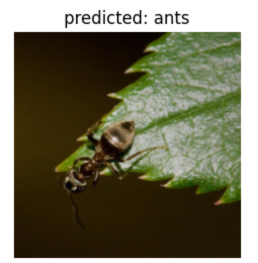
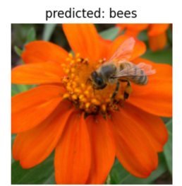
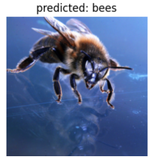
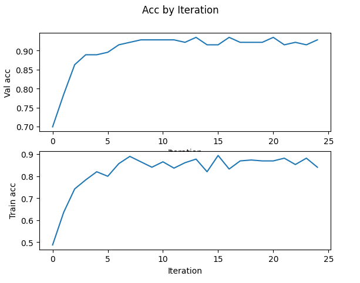

# Transfer Learning for Image Classification

This task implements transfer learning for image classification using the ResNet18 architecture. The model is trained on the Hymenoptera dataset (bees and ants) using PyTorch and fine-tuned for improved accuracy.

## Dataset
The dataset consists of labeled images of bees and ants. It is automatically downloaded and extracted within the notebook.

## Features
- Transfer Learning: Utilizing a pretrained ResNet18 model to improve classification performance.
- Data Augmentation: Applying transformations such as random cropping, flipping, and color jittering.
- Fine-Tuning: Modifying the fully connected layers to adapt to the new dataset.
- Visualization: Displaying training progress, accuracy trends, and model predictions.
- TensorBoard Integration: Logging training metrics for detailed performance analysis.

## Model Training Workflow
### 1. Data Preparation
- The dataset is loaded and transformed using `torchvision.transforms`.
- Data augmentation techniques improve model robustness.

### 2. Model Training
- A ResNet18 model is initialized and trained.
- The fully connected layer is modified to classify bees and ants.
- The model is trained using Cross-Entropy loss and an Adam optimizer.
- Learning rate scheduling is applied for better convergence.

### 3. Evaluation & Fine-Tuning
- The trained model is evaluated on the validation set.
- The pretrained ResNet18 model is fine-tuned for improved accuracy.
- Performance is measured using accuracy and loss curves.

## Visualization
### Sample Image Grid
A batch of training images is displayed along with their respective labels.

    
    
    

### Training Accuracy Trends
A graph showing accuracy improvements over iterations.

## Results
- The model achieves high classification accuracy on the validation set.
- Transfer learning significantly boosts performance compared to training from scratch.

## License
This project is open-source and available under the MIT License.

## Contact

For any questions or collaboration opportunities, feel free to reach out at [hey@njoguevans.me](mailto:hey@njoguevans.me).
